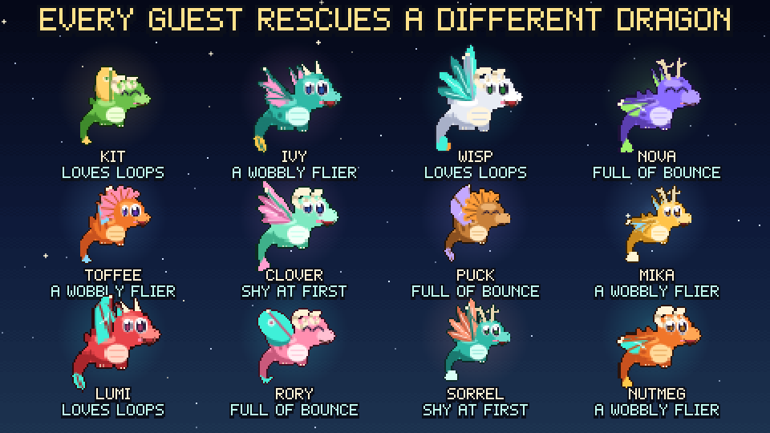
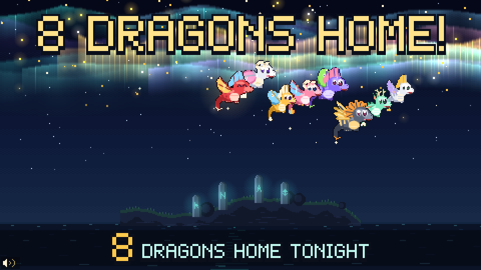
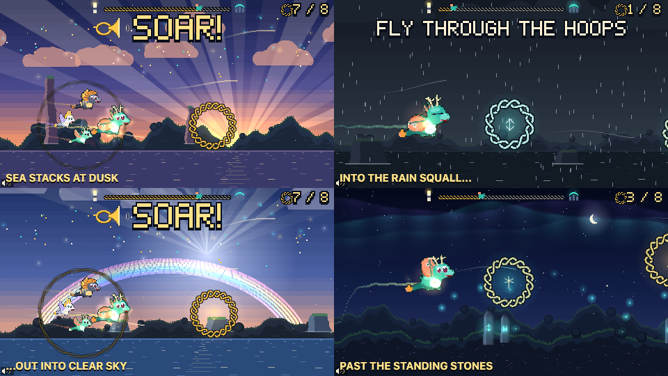

# Design Intent: *Emberwing: The Way Home*

**Symphonicon pre-show interactive · Walla Walla Symphony · Nov 5 · Cordiner Hall lobby**
**Paired piece:** *From the Motion Picture How to Train Your Dragon*, John Powell (arr. O'Loughlin), played in Act II by the Walla Walla Symphony Youth Orchestra (Bruce Walker, conductor)

| | | |
|---|---|---|
|  |  |  |
| *FIND THE EYES, with a trail of light to them* | *YOU FOUND (this guest's dragon)!* | *The brass swell: everyone already home flies out to meet you* |

## Guest experience overview

A guest steps onto the footprints in front of a 10-foot projection, raises a big lantern prop, and becomes the keeper of a tiny northern lighthouse. In **about 40 to 50 seconds**, their light finds a frightened young dragon in a storm, gives it the courage to fly, and guides it home under the aurora. There is no losing, no reading, and no clicking. The guest just points a light.

**Every guest rescues a different dragon.** Emberwings are a kind of small dragon, and each one is built from parts: body color, wing shape, horns or frill or antlers, tail tip, eyes, size, and a little personality (one sneezes sparks, one loves loops, one is shy at first). Each gets its own name, never repeated in a night. Your dragon is yours: you see its name on the title card, it flies with its own quirks, and at the end you get its card.

**The flock is everyone's dragons.** Every dragon that makes it home stays for the rest of the evening. The flock circling on the attract screen, swooping in at the brass swell, and circling the stones at home is always exactly the dragons people brought home tonight, so the number on screen and the dragons you can count always agree. Every 8th dragon home sets off a celebration.

The line behind them is the audience. While they wait, a storybook on screen turns its own pages, showing the dragon that's lost right now, and a "ghost" player shows exactly what to do. Above it, tonight's flock circles and a countdown says how many more dragons until the next celebration. By the time their turn comes, they already know how to play.

## Story beats

| Beat | Time | What the guest sees and does |
|---|---|---|
| **Next Flyer** | loop | A storybook shows the storm, *PIP IS LOST*, a ghost player demo, and "Hear it in Act II". Tonight's flock circles above the lantern and a countdown reads *3 MORE TO THE NEXT CELEBRATION*. The screen says *STEP HERE · RAISE YOUR LIGHT*. Holding the light on the lantern for 1 s starts the story. |
| **1. Find** | ~6-15 s | A title card: *PIP IS LOST!* Then a dark, rainy cliff in the fog. The guest's lantern beam, shining from the lighthouse (a nod to the bat-signal proof of concept), cuts through the fog. One instruction at a time, each with a tiny demo: *MOVE YOUR LIGHT*, then *FIND THE EYES*, then *HOLD STILL*. A knotwork ring on the eyes fills while the light is on them and simply pauses if it slips off. If someone is struggling, the hints get stronger (bigger eyes, a trail of light to them, the beam leaning their way), but the guest always does the finding. Then everything holds still for **YOU FOUND PIP!** as the dragon crouches, pops up and wiggles, wings lit again, and a warm chord plays. |
| **2. First Flight** | ~20 s | A title card: *NOW FLY HOME!* Then *PIP FOLLOWS YOUR LIGHT*, with an arrow from the light to the dragon, and *FLY THROUGH THE HOOPS*. The first hoop waits right next to the dragon until the guest steers through it. Then 7 more arrive on the beat, one every two seconds, each with a chime, a "3 / 8" counter, and a track showing the journey from the lighthouse to home. Three routes take turns between guests: out past sea stacks as the storm turns to dusk and gold, into a rain squall and out into clear sky with a rainbow, or low over standing stones while the aurora comes out. The dragon cheers at every hoop, does a barrel roll after three in a row, and shows off its own quirk. At the **brass swell** the music and the sky hold their breath, then the brass bursts in with golden rays, a knotwork shockwave and confetti, and **everyone already home tonight swoops in**, each with a chirp. The first guest of the night does it alone. A missed hoop is never a failure: the dragon does a happy loop and the hoop's sparkles find it anyway. |
| **3. Home** | ~5 s | The guest's dragon lands in a circle with tonight's flock above the standing stones under the northern lights, and they chirp hello one by one. The path the guest flew is drawn across the sky like a comet, then lifts and becomes a **new aurora ribbon that stays for the rest of the evening**. A shimmer runs across the whole aurora and the counter lands on the new number (*37 DRAGONS HOME TONIGHT*). **Every 8th dragon** adds a few seconds: the whole flock breaks out for a flyover, the aurora flares and *8 DRAGONS HOME!* fills the sky. |
| **4. The dragon card** | 5 s | A card for the dragon the guest rescued, made for a phone photo: portrait, name, *THE 9TH EMBERWING HOME TONIGHT*, its quirk, and *HEAR IT LIVE IN ACT II · How to Train Your Dragon · Listen for the brass!* Then the screen returns to *Next Flyer*. The full credit (Walla Walla Symphony Youth Orchestra) is on the storybook's music page for the line to read while they wait. |

## The one feeling

> **"I helped someone brave find their way home, and my light is still up there."**

It should feel warm, windswept, hopeful and proud. Every guest succeeds, and every guest leaves a visible mark in a shared sky that grows all evening: their ribbon in the aurora and their dragon in the flock. That's the "this space is for everyone" moment: by intermission, the wall shows a hundred flights woven together and a sky full of dragons that each have a name.

## Station layout needs

- **Screen:** one of the large walls beside the main entry door, or the 10 × 6 ft rear-projection screen. Designed for 1920 × 1080, readable from 15 ft (prompts are about 4-9 inches tall on a 10-ft image).
- **Floor:** a footprints decal about 10-12 ft from the screen, centered. The line queues to one side so the players and the waiting guests share the view without blocking the projector.
- **Prop:** a big cardboard lantern tracked by motion capture drives the on-screen light. A mouse or touch works as a backup, with no code changes.
- **Operator:** one laptop running the game locally (no internet needed). Press any key once to start the station (browsers need that before they allow sound). Hidden keys: fullscreen, reset, skip, debug, clear, sound, calibrate, reduced motion. A small speaker icon in the corner shows whether sound is running.
- **Sound:** on by default through the laptop or the room's speakers, but never required. The lobby is loud, so every sound has a visual twin and the game reads exactly the same muted (**M**).
- **Throughput:** about 40 to 50 s per guest plus a short handoff, so roughly 30 guests per 30-minute shift, or about 90 over the 90-minute pre-show. The game resets itself after 10 s without input.
- **Accessibility:** no flashing faster than 3 times per second, no fail states, and color is never the only signal (brightness, shape and motion carry every cue). It works seated, and a phone version works in landscape via the public URL.

## How it connects to the music

The program notes describe Powell's score as drawing on **Scottish, Celtic, Nordic and Irish folk** influences, with **soaring flight music thundering in the brass**. The game uses those ideas in what you see *and* what you hear, without borrowing a note of the film:

- **An original folk tune.** A short melody in D mixolydian (the flattened seventh gives it a Scottish and Irish lilt, with a Scotch snap in the rhythm) on harp, tin whistle, drone and hand drum, generated live in the browser. It's gentle while the line waits, sparse and windy in the fog, and builds layer by layer through the flight.
- **The brass swell, shown and heard.** At the swell the music holds its breath for a drum roll, then a full brass chord lands on the downbeat and the brass takes over the tune, while golden rays, a shockwave and the whole flock fill the screen. Muted, the visuals carry the same moment.
- **Folk art as the visual language.** Knotwork interlace frames every ring, meter and border. Standing stones carry glowing runes. The world is storybook northern islands, sea cliffs, and aurora skies. It is entirely original: no characters, places or designs from the films.
- **Tempo you can see and hear.** The whole world breathes at 120 BPM. Wind ribbons brighten on every beat, rune rings arrive on the beat and chime in key, and stones pulse in time.
- **A bridge to the concert.** The dragon card and the storybook send every guest into the hall listening for this moment when the Youth Orchestra plays it in Act II.

