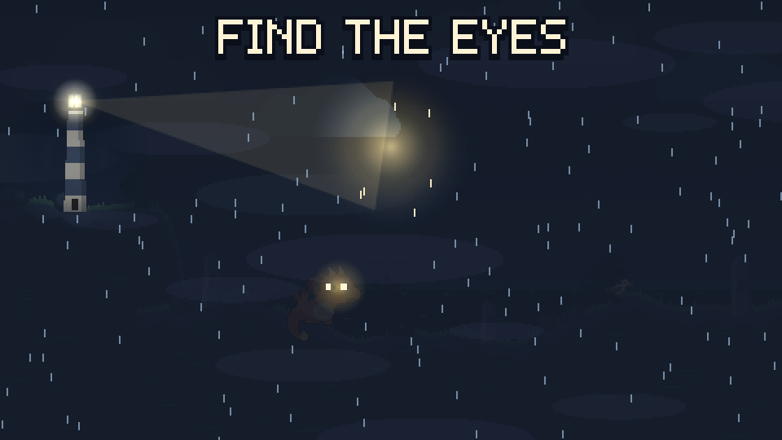
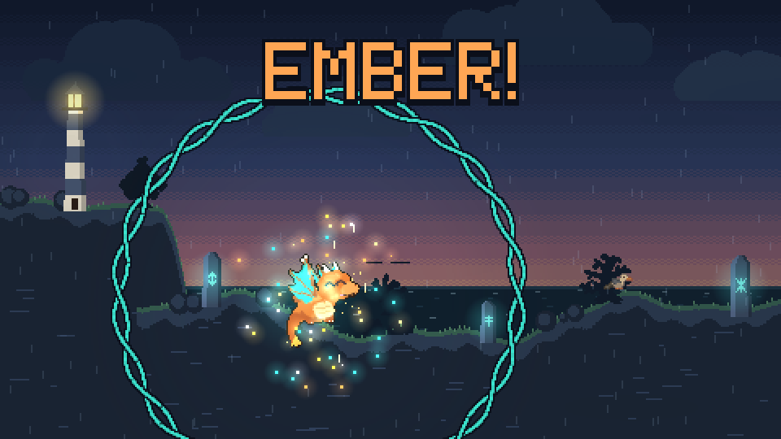
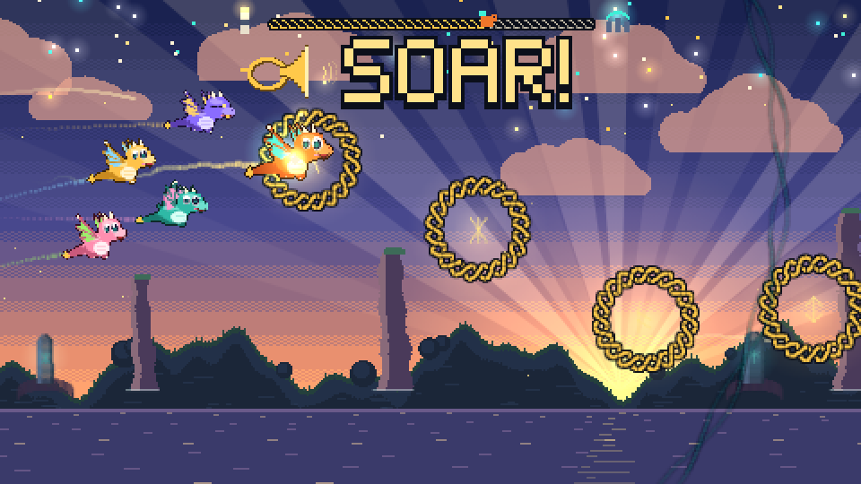
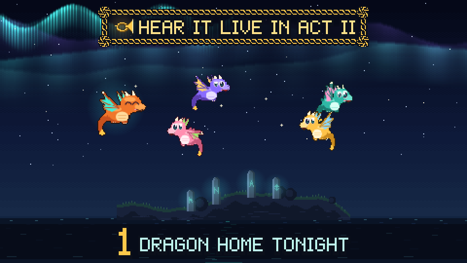

# Design Intent: *Emberwing: The Way Home*

**Symphonicon pre-show interactive · Walla Walla Symphony · Nov 5 · Cordiner Hall lobby**
**Paired piece:** *From the Motion Picture How to Train Your Dragon*, John Powell (arr. O'Loughlin), played in Act II by the Walla Walla Symphony Youth Orchestra (Bruce Walker, conductor)

| | | |
|---|---|---|
|  |  |  |
| *Your light cuts the fog* | *Found! A happy wiggle, wings glowing again* | *The brass swell: the flock joins* |

## Guest experience overview

A guest steps onto the footprints in front of a 10-foot projection, raises a big lantern prop, and becomes the keeper of a tiny northern lighthouse. In **about 38 seconds** (never more than about 41), their light finds a frightened young dragon in a storm, gives it the courage to fly, and guides it home under the aurora. There is no losing, no reading, and no clicking. The guest just points a light.

The line behind them is the audience. While they wait, a storybook on screen turns its own pages and a "ghost" player shows exactly what to do. By the time their turn comes, they already know how to play.

## Story beats

| Beat | Time | What the guest sees and does |
|---|---|---|
| **Next Flyer** | loop | A storybook shows the storm, the lost dragon, a ghost player demo, and "Hear it in Act II". The screen says *STEP HERE · RAISE YOUR LIGHT*. Holding the light on the lantern for 1 s starts the story. |
| **1. Find Ember** | ~6 s | "EMBER IS LOST!" A dark, rainy cliff in the fog. The guest's lantern beam, shining from the lighthouse (a nod to the bat-signal proof of concept), cuts through the fog. Two small eyes blink. The guest holds the light steady and a Celtic knotwork ring fills. Jerky light makes Ember flinch; calm light makes it lean in. Ember crouches, pops up, does a happy wiggle, and its wings reignite in teal and gold: **EMBER!** |
| **2. First Flight** | 20 s | Ember follows the light (a dotted trail of light shows it's following *you*) out over sea stacks and standing stones, through rune rings that arrive on the beat. A track across the top shows the journey from the lighthouse to home. The flight starts wobbly under slate-blue skies. Ember cheers at every ring and does a barrel roll after three in a row. At the **brass swell** the sky holds its breath, then golden rays, a knotwork shockwave and confetti burst out, a horn icon appears, and four flock-mates swoop in with light trails. A missed ring is never a failure: Ember does a happy loop and the ring's sparkles find it anyway. |
| **3. Home** | 6.5 s | The flock circles a stone circle under the northern lights. The path the guest flew is drawn across the sky like a comet, then lifts and becomes a **new aurora ribbon that stays for the rest of the evening**. A shimmer runs across the whole aurora, the counter rolls up (*37 DRAGONS HOME TONIGHT*), and a banner appears: *HEAR IT LIVE IN ACT II*. |
| **4. Hear it live** | 3 s | Three big lines: *ACT II · How to Train Your Dragon · Listen for the brass!* Then the screen returns to *Next Flyer*. The full credit (Walla Walla Symphony Youth Orchestra) is on the storybook's music page for the line to read while they wait. |

## The one feeling

> **"I helped someone brave find their way home, and my light is still up there."**

It should feel warm, windswept, hopeful and proud. Every guest succeeds, and every guest leaves a visible mark in a shared sky that grows all evening. That's the "this space is for everyone" moment: by intermission, the wall shows a hundred flights woven together.

## Station layout needs

- **Screen:** one of the large walls beside the main entry door, or the 10 × 6 ft rear-projection screen. Designed for 1920 × 1080, readable from 15 ft (prompts are about 4-9 inches tall on a 10-ft image).
- **Floor:** a footprints decal about 10-12 ft from the screen, centered. The line queues to one side so the players and the waiting guests share the view without blocking the projector.
- **Prop:** a big cardboard lantern tracked by motion capture drives the on-screen light. A mouse or touch works as a backup, with no code changes.
- **Operator:** one laptop running the game locally (no internet needed). Hidden keys: fullscreen, reset, skip, debug, clear, audio.
- **Sound:** not required. The lobby is loud and the game is fully visual. Optional ambience can be turned on if the space allows.
- **Throughput:** about 38 s per guest plus a short handoff, so roughly 35 guests per 30-minute shift, or 100+ over the 90-minute pre-show. The game resets itself after 10 s without input.
- **Accessibility:** no flashing faster than 3 times per second, no fail states, and color is never the only signal (brightness, shape and motion carry every cue). It works seated, and a phone version works in landscape via the public URL.

## How it connects to the music

The program notes describe Powell's score as drawing on **Scottish, Celtic, Nordic and Irish folk** influences, with **soaring flight music thundering in the brass**. With the sound off, the game makes those ideas *visible*:

- **Folk art as the visual language.** Knotwork interlace frames every ring, meter and border. Standing stones carry glowing runes. The world is storybook northern islands, sea cliffs, and aurora skies. It is entirely original: no characters, places or designs from the films.
- **Tempo you can see.** The whole world breathes at 120 BPM. Wind ribbons brighten on every beat, rune rings arrive on the beat, and stones pulse in time.
- **The brass swell, shown not heard.** The flight builds like the score: hesitant, then confident, then golden rays, a wider sky and the flock joining together.
- **A bridge to the concert.** The final card and the storybook send every guest into the hall listening for this moment when the Youth Orchestra plays it in Act II.
