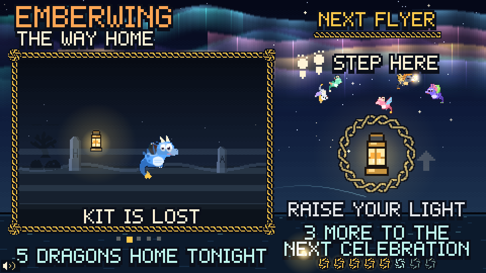

# Emberwing: The Way Home

A 40-second lobby interactive for the Walla Walla Symphony's **Symphonicon** (Nov 5, Cordiner Hall), paired with *From the Motion Picture How to Train Your Dragon* (John Powell), played in Act II by the Walla Walla Symphony Youth Orchestra.

A young dragon, Ember, is blown off course in a storm. The guest is the lighthouse keeper. Their light finds Ember in the fog, teaches it to fly, and guides it home to its flock. Each guest's flight path becomes a ribbon in the aurora and stays there for the rest of the evening.

- **One pointer, no clicks.** Mouse, touch, or a motion-capture prop all work. Every "button" is *hover and hold* (a knotwork ring fills in about 1 second).
- **Works with the sound off.** Every cue is visual. Audio is optional ambience, off by default.
- **Static site.** Vite plus vanilla JS and Canvas. No server code. Runs on GitHub Pages or any static host.



---

## Run it

```bash
npm install
```

```bash
npm run dev
```

This opens http://localhost:5173. Move the mouse onto the lantern and hold it there to start.

Production build + local static server (use this on the lobby laptop):

```bash
npm run build && npm run preview
```

`npm run preview` serves `dist/` at http://localhost:4173 and on your LAN IP.

### URL options

| Parameter | Effect |
|---|---|
| `?mocap=wss://host:port` | Connect a motion-capture WebSocket (see below) |
| `?mocapFlipX=1` / `?mocapFlipY=1` | Mirror mocap axes (camera facing the guest) |
| `?debug` | Start with the debug overlay on |
| `?scene=flight` | Jump straight to a scene (`attract`, `find`, `flight`, `home`, `end`) |
| `?seed=5` | Deterministic randomness (for testing) |

## Operator hotkeys

Hidden from guests. Nothing on screen mentions them.

| Key | Action |
|---|---|
| **F** | Toggle fullscreen |
| **R** | Reset to attract |
| **S** | Skip to the next scene |
| **D** | Debug overlay (FPS, scene timer, pointer x/y, speed, idle time, mocap status) |
| **C** | Clear tonight's aurora. Asks on screen first: **Y** clears, anything else keeps |
| **M** | Ambient audio on/off (off by default) |
| **K** | Calibrate the mocap rig: point at the 4 corner rings and hold still (see below). In the calibration screen **Space** grabs a corner, **Esc** cancels, **Delete** clears the saved calibration |
| **G** | Reduced motion: AUTO (follows the OS setting), FORCED REDUCED, FORCED FULL. Reduced = no shake, softer flashes, calmer flight camera. Remembered across refreshes |
| Arrows / Space | Move the pointer / "hold" (desk testing only) |

Before a shift, run through [PLAYTEST.md](PLAYTEST.md) on the real projector.

The aurora (every guest's ribbon, plus the "N dragons home tonight" count) is saved to `localStorage`, so a refresh or a crashed tab doesn't wipe the wall. It starts fresh automatically on a new calendar day. Use **C** to clear it by hand.

## Timing (all in `src/config.js`)

| Scene | Target | Notes |
|---|---|---|
| Attract | loop | 1 s hold on the lantern starts a run |
| Find Ember | ~5-8 s | Opens with "EMBER IS LOST!", then a 2 s steady hold on the eyes. Assists at 3 s (sparks lead the way), 4.5 s (Ember hops to the light) and 7 s (auto-complete) |
| Flight | 20 s fixed | Rings on the beat (120 BPM), a lighthouse-to-home track across the top. Brass swell at 62% (with a ~0.7 s wind-up), climb at 90% |
| Home | 6.5 s | Ribbon lifts into the aurora, a shimmer runs across the sky, the counter rolls up, then "HEAR IT LIVE IN ACT II" |
| End card | 3 s | "ACT II", the title, "LISTEN FOR THE BRASS!". Hold the small lantern to skip |
| Scene fades | 0.4 s | `DUR.FADE` |

Measured by the Playwright suite: **~38 s** for a typical guest, **~40.5 s** for a guest who never finds Ember on their own (the test fails above 41 s). **Idle reset:** 10 s without input during Find Ember or Flight returns to attract. The assists only count time while someone is actually pointing, so an abandoned game resets instead of playing itself.

**Slow laptops:** the game clock follows real time even when frames drop (it catches up in small steps, `LOOP` in `config.js`), so a choppy laptop doesn't make runs longer. Below about 4 fps it starts to slow down, and a frozen or backgrounded tab only moves the game forward a quarter second when it comes back. The YOURS! label after a run lasts `DUR.YOURS_LABEL` (15 s).

## Connecting a motion-capture cursor

The game only needs one x/y point. Pick whichever is easiest for your rig:

1. **The rig drives the OS mouse cursor.** Nothing to configure. It works like a mouse. Clicking is never required.
2. **WebSocket.** Open the game with `?mocap=<url>`. Send one message per frame, either as JSON or as plain text:
   ```json
   {"x": 0.52, "y": 0.38}
   ```
   or `0.52,0.38`. Coordinates are **normalized 0..1 across the game image** (origin top-left). An optional `"hold": true` is accepted but not needed. The adapter reconnects automatically. Status shows on the **D** overlay.
3. **Same page / parent frame:**
   `window.emberwingPointer(x, y)` or `window.postMessage({ type: 'emberwing-pointer', x, y }, '*')`.

Motion-capture input goes through a One-Euro jitter filter tuned heavier than the mouse filter (`INPUT.FILTER.mocap` in `config.js`).

### Calibration (K)

If the light doesn't land where the prop points (offset, squashed, or a keystoned projector), press **K** with the rig connected. Point the prop at each corner ring and hold it still until the ring fills (about 1 s); the pink cross shows where the rig *thinks* it's pointing. After the 4th corner the mapping is saved to `localStorage` and shows up in the debug overlay (**D**) as `CAL MOCAP <date>`. It only applies to the input source you calibrated with, so a desk mouse keeps working normally. Press **K** then **Delete** to clear it.

### Phones

On touch screens the light sits about 40 px above your fingertip (`INPUT.TOUCH_LIFT`), so your finger doesn't cover it or Ember.

### HTTPS and WebSockets (important for GitHub Pages)

GitHub Pages is served over **HTTPS**. Browsers block a plain `ws://` connection from an HTTPS page to another machine (mixed content). Your options:

| Where the game runs | Mocap URL that works |
|---|---|
| GitHub Pages (HTTPS) | `wss://…` (a TLS WebSocket), **or** `ws://localhost:PORT` / `ws://127.0.0.1:PORT` with the bridge on the same laptop |
| `npm run preview` on the lobby laptop (HTTP) | Anything, including `ws://192.168.x.x:PORT` on the LAN |

If you pass a remote `ws://` URL while on HTTPS, the adapter switches it to `wss://` and prints the reason on the debug overlay. For the lobby, the most reliable setup is **Chrome on the lobby laptop, running `npm run preview`, with the mocap bridge on the same machine** (`http://localhost:4173/?mocap=ws://localhost:8765`). It needs no internet and has no certificate trouble.

A minimal test bridge (Python, `pip install websockets`) that sends a slowly circling point:

```python
import asyncio, json, math, time, websockets

async def feed(ws):
    while True:
        t = time.time()
        await ws.send(json.dumps({"x": 0.5 + 0.3 * math.cos(t), "y": 0.5 + 0.2 * math.sin(t)}))
        await asyncio.sleep(1 / 60)

async def main():
    async with websockets.serve(feed, "localhost", 8765):
        await asyncio.Future()

asyncio.run(main())
```

Replace the circle with your tracker's prop position mapped to 0..1.

## Deploy to GitHub Pages

The repo includes `.github/workflows/pages.yml`, which builds and deploys `dist/` on every push to `main`.

1. Create an empty repo on GitHub (no README or license, so the first push is clean), or from the project folder: `gh repo create <repo-name> --public --source . --remote origin`
2. Push: `git push -u origin main`
3. In **Settings → Pages**, set **Build and deployment → Source** to **GitHub Actions** (one time). Or: `gh api -X POST repos/<user>/<repo-name>/pages -f build_type=workflow`
4. If the first workflow run happened before step 3 and failed, re-run it from the **Actions** tab (or push again).
5. The site appears at `https://<user>.github.io/<repo-name>/`. Check it plays:

```bash
LIVE_URL=https://<user>.github.io/<repo-name>/ npm run smoke
```

The smoke test (`tests-live/`) loads the live site, checks for errors and missing files, checks the sprites load from the repo's subpath, and plays one full scripted run.

The workflow sets `BASE_PATH=/<repo-name>/` for Vite. Locally the default base is `./` (relative paths), so `dist/` also works from any other static host or subfolder, including Heroku static hosting.

**Licensed art:** `./assets` (the purchased pixel-art packs) is in `.gitignore` because the licenses forbid redistributing the packs. Only the four cropped sprites in `public/sprites/` are committed. Re-crop them with `npm run sprites` (needs Python + Pillow and the packs in `./assets`). See [CREDITS.md](CREDITS.md).

## Tests

```bash
npm test
```

This builds the site, serves it, and runs Playwright:

- **`tests/fullrun.spec.js`**: a scripted guest plays a whole run by pointer only. It asserts 35-45 s, that the ribbon persists across a refresh, that a guest who never finds Ember still finishes in time, and that the end card can be skipped.
- **`tests/idle.spec.js`**: walking away during Find Ember or Flight resets to attract after about 10 s.
- **`tests/input.spec.js`**: the mocap pointer path, the clear confirmation, the portrait "rotate your phone" hint, and the touch offset.
- **`tests/story.spec.js`**: the story beats show up when they should: "EMBER IS LOST!" first, the Act II line during Home, the brass swell's wind-up, firing and flock join, and "YOURS!" on attract after a finished run (but not after an idle reset).
- **`tests/framerate.spec.js`**: at 8 fps the game clock still keeps real time, a frozen tab only nudges the game forward, and a full run at ~8 fps lands within 2 s of a normal one.
- **`tests/motion.spec.js`**: reduced motion follows the OS setting, **G** cycles and is remembered, no shake and a calmer camera when reduced.
- **`tests/calibration.spec.js`**: a deliberately misaligned pretend rig is fixed by **K**, the calibration survives a refresh, Delete clears it, and a mouse isn't affected.
- **`tests/screenshots.spec.js`**: `npm run shots` writes every scene at 1920×1080 and phone landscape to `tests/screens/`.

## Code map

```
src/config.js          every tunable number (durations, tempo, thresholds, palette)
src/main.js            loop, letterbox scaling, test hooks
src/input/             Input (one pointer), adapters (mouse/touch/mocap/keys), OneEuroFilter, Dwell
src/core/              SceneManager, Beat (120 BPM), Camera, Particles, AuroraStore, Audio, Operator
src/art/               font (pixel font), knotwork, ember, world, aurora, icons, sprites
src/scenes/            Attract, FindEmber, Flight, Home, EndCard
```

Everything renders into a 480×270 buffer that is scaled up with nearest-neighbor (4× on a 1080p projector), so it stays crisp from across the lobby.
