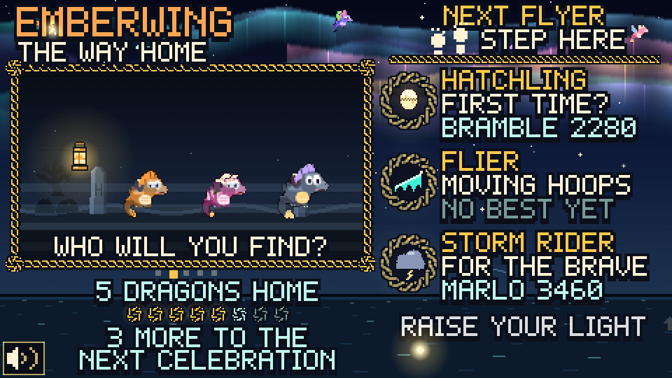

# Emberwing: The Way Home

A lobby game we made for the Walla Walla Symphony's Symphonicon (Nov 5, Cordiner Hall). In Act II the youth orchestra plays music from *How to Train Your Dragon*, so while people wait for the concert they get to rescue a lost baby dragon of their own. You're the lighthouse keeper: point your light to find the dragon in the fog, then guide it home through a string of hoops. A run takes about 45 seconds and nobody can lose. Every dragon that gets home joins tonight's flock and leaves a ribbon in the aurora. It's built for a 10 ft projector and a motion-capture lantern prop, but a mouse or a phone works too. There are three levels so little kids, teens and grandparents can all have a go.




## Running it

You need Node 22.

```bash
npm install
```

```bash
npm run dev
```

Then open http://localhost:5173. On the lobby laptop use the real build instead:

```bash
npm run build && npm run preview
```

That serves `dist/` at http://localhost:4173 (and on the LAN).

Browsers won't play sound until someone presses a key, so on a laptop the game first says PRESS ANY KEY TO START. That key only starts the station, it doesn't skip anything (M starts it muted). Phones skip this step and the first touch turns the sound on.

Handy URL options:

| Option | What it does |
|---|---|
| `?mocap=ws://host:port` | Connect a mocap WebSocket (see below) |
| `?mocapFlipX=1`, `?mocapFlipY=1` | Mirror a mocap axis |
| `?debug` | Start with the debug overlay on |
| `?scene=flight` | Jump to a scene: `attract`, `choose`, `find`, `flight`, `home`, `celebration`, `end` |
| `?level=storm` | Pick the level when jumping to a scene: `hatchling`, `flier`, `storm` |
| `?route=1` | Always use one flight route (0, 1 or 2) instead of taking turns |
| `?seed=5` | Same random dragons and hoops every time, for testing |

## How to play

Nothing needs a click. Every button is "hold the light on it" and a ring fills up.

1. Hold your light on a level on the right: HATCHLING (big slow hoops), FLIER (smaller moving hoops, a few silly enemies) or STORM RIDER (small hoops, more enemies, wind). Holding still near the middle for 2 seconds also starts HATCHLING.
2. Pick which lost dragon you'll find. If nobody picks, one gets picked after 5 seconds.
3. Find the dragon's two glowing eyes in the fog and hold still on them until the ring fills.
4. Fly. The dragon follows your light. Steer through the hoops, fly through power-ups (fireball, speed, shield, magnet, flock friend) and around the grumpy clouds. A bump only makes it tumble.
5. It lands home with everyone else from tonight and you get its card, with your score and 1 to 3 stars.

Every 8th dragon home sets off a celebration and leaves a new star in the sky. If someone walks away mid-game it goes back to the start after 10 seconds. All the numbers we tuned in playtesting (levels, timings, scoring, enemies) are in `src/config.js`.

## Operator hotkeys

Guests never see these.

| Key | What it does |
|---|---|
| F | Fullscreen |
| R | Back to the start screen |
| S | Skip to the next scene |
| D | Debug overlay: FPS, scene timer, pointer, idle time, sound, mocap status |
| C | Clear tonight's dragons, ribbons and best flights. It asks first: Y clears, anything else keeps |
| M | Sound on/off, remembered after a refresh |
| G | Reduced motion: auto (follows the OS), forced on, forced off. Also remembered |
| K | Calibrate the mocap rig (see below) |
| Arrows, Space | Move the light and "hold", for testing at a desk |

The speaker in the bottom left corner also turns sound on and off: click it, tap it, or hold the light on it. The night is saved in `localStorage`, so a refresh or a crashed tab doesn't lose the flock. It starts over by itself on a new day.

## Hooking up the mocap cursor

The game only needs one x/y point. Any of these works:

1. **The rig moves the OS mouse.** Nothing to set up.
2. **WebSocket.** Open the game with `?mocap=ws://localhost:8765` and send one message per frame, either `{"x": 0.52, "y": 0.38}` or just `0.52,0.38`. Both go from 0 to 1 across the game picture, starting top left. It reconnects on its own and the D overlay shows whether it's connected.
3. **Same page or a parent frame.** Call `window.emberwingPointer(x, y)` or `postMessage({ type: 'emberwing-pointer', x, y }, '*')`.

**Calibrating.** If the light doesn't land where the prop points, press K, point at each of the 4 corner rings and hold still until it fills. The pink cross shows where the rig thinks it's pointing. The fix gets saved and only applies to the mocap input, so a mouse still works normally. K then Delete clears it.

**HTTPS.** GitHub Pages is HTTPS, and browsers block a plain `ws://` connection to another machine from an HTTPS page. Use `wss://`, or run the bridge on the same laptop (`ws://localhost` is allowed). For the lobby the easiest setup is `npm run preview` on the lobby laptop with the bridge on the same machine: http://localhost:4173/?mocap=ws://localhost:8765

A tiny test bridge (Python, `pip install websockets`) that sends a point going around in a circle:

```python
import asyncio, json, math, time, websockets

async def feed(ws):
    while True:
        t = time.time()
        await ws.send(json.dumps({"x": 0.5 + 0.3 * math.cos(t), "y": 0.5 + 0.2 * math.sin(t)}))
        await asyncio.sleep(1 / 60)

async def main():
    async with websockets.serve(feed, "localhost", 8765):
        await asyncio.Future()

asyncio.run(main())
```

Swap the circle for your tracker's prop position, mapped to 0..1.

## Deploying

Every push to `main` runs `.github/workflows/pages.yml`, which builds the game and puts it on GitHub Pages at https://tabishnavaid.github.io/emberwing/. On a new copy of the repo, set Settings > Pages > Source to GitHub Actions once first.

To check the live site actually plays:

```bash
LIVE_URL=https://tabishnavaid.github.io/emberwing/ npm run smoke
```

The build uses relative paths, so `dist/` also works on any other static host.

## Tests

```bash
npm test
```

This builds the site and runs the Playwright tests, about 10 minutes since a lot of them play whole runs in real time. `npm run shots` saves a screenshot of every scene to `tests/screens/`. Keep the laptop plugged in and awake while it runs, long runs stall on battery or with the lid closed.

## Art

The gull and three trees are cropped from licensed art packs we're allowed to use but not share, so the packs aren't in the repo (`assets/` is ignored). `npm run sprites` crops them again if you have the packs. Everything else, including the dragons and the music, is drawn or synthesized in code. See [CREDITS.md](CREDITS.md).

Made by: Hana, Tabish, Tigistu, TJ
